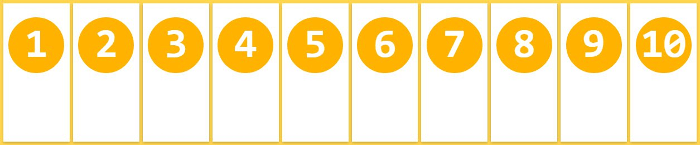
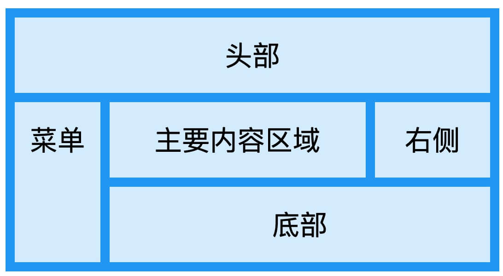
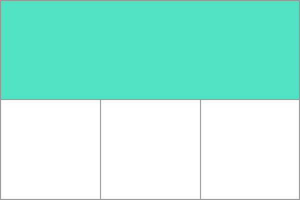

# 一.CSS3 简介

CSS3 被拆分为"模块"。旧规范已拆分成小块，还增加了新的。

一些最重要 CSS3 模块如下：

- 选择器
- 盒模型
- 背景和边框
- 文字特效
- 2D/3D转换
- 动画
- 多列布局
- 用户界面

# 二.弹性盒子(Flex Box)

弹性盒子是 CSS3 的一种新的布局模式。

CSS3 弹性盒（ Flexible Box 或 flexbox），是一种当页面需要适应不同的屏幕大小以及设备类型时确保元素拥有恰当的行为的布局方式。

引入弹性盒布局模型的目的是提供一种更加有效的方式来对一个容器中的子元素进行排列、对齐和分配空白空间。

弹性盒子由弹性容器(Flex container)和弹性子元素(Flex item)组成。

弹性容器通过设置 display 属性的值为 flex 或 inline-flex将其定义为弹性容器。

**注意：** 弹性容器外及弹性子元素内是正常渲染的。弹性盒子只定义了弹性子元素如何在弹性容器内布局。


容器默认存在两根轴：水平的主轴（main axis）和垂直的交叉轴（cross axis）。主轴的开始位置（与边框的交叉点）叫做main start，结束位置叫做main end；交叉轴的开始位置叫做cross start，结束位置叫做cross end。

项目默认沿主轴排列。单个项目占据的主轴空间叫做main size，占据的交叉轴空间叫做cross size。

## 1.flex-direction属性

flex-direction属性决定主轴的方向（即项目的排列方向）。


```css
.box {
  flex-direction: row | row-reverse | column | column-reverse;
}
```

- row（默认值）：主轴为水平方向，起点在左端。
- row-reverse：主轴为水平方向，起点在右端。
- column：主轴为垂直方向，起点在上沿。
- column-reverse：主轴为垂直方向，起点在下沿。

## 2.flex-wrap属性

默认情况下，项目都排在一条线（又称”轴线”）上。flex-wrap属性定义，如果一条轴线排不下，如何换行。


```css
.box{
  flex-wrap: nowrap | wrap | wrap-reverse;
}
```

- nowrap（默认）：不换行。

  

- wrap：换行，第一行在上方。

  

- wrap-reverse：换行，第一行在下方。

  

## 3.flex-flow

flex-flow属性是flex-direction属性和flex-wrap属性的简写形式，默认值为row nowrap。

```css
.box {
  flex-flow: <flex-direction> <flex-wrap>;
}
```

## 4.justify-content属性

justify-content属性定义了项目在主轴上的对齐方式。

```css
.box {
  justify-content: flex-start | flex-end | center | space-between | space-around;
}
```


- flex-start（默认值）：左对齐
- flex-end：右对齐
- center： 居中
- space-between：两端对齐，项目之间的间隔都相等。
- space-around：每个项目两侧的间隔相等。所以，项目之间的间隔比项目与边框的间隔大一倍。

## 5.align-items属性

align-items属性定义项目在交叉轴上如何对齐。

```css
.box {
  align-items: flex-start | flex-end | center | baseline | stretch;
}
```


- flex-start：交叉轴的起点对齐。
- flex-end：交叉轴的终点对齐。
- center：交叉轴的中点对齐。
- baseline: 项目的第一行文字的基线对齐。
- stretch（默认值）：如果项目未设置高度或设为auto，将占满整个容器的高度。

## 6.align-content属性

align-content属性定义了多根轴线的对齐方式。如果项目只有一根轴线，该属性不起作用。

```css
.box {
  align-content: flex-start | flex-end | center | space-between | space-around | stretch;
}
```


- flex-start：与交叉轴的起点对齐。
- flex-end：与交叉轴的终点对齐。
- center：与交叉轴的中点对齐。
- space-between：与交叉轴两端对齐，轴线之间的间隔平均分布。
- space-around：每根轴线两侧的间隔都相等。所以，轴线之间的间隔比轴线与边框的间隔大一倍。
- stretch（默认值）：轴线占满整个交叉轴。

## 7.项目的属性

### 7.1order属性

order属性定义项目的排列顺序。数值越小，排列越靠前，默认为0。

```css
.item {
  order: <integer>;
}
```


### 7.2flex-grow属性

flex-grow属性定义项目的放大比例，默认为0，即如果存在剩余空间，也不放大。

```css
.item {
  flex-grow: <number>; /* default 0 */
}
```


如果所有项目的flex-grow属性都为1，则它们将等分剩余空间（如果有的话）。如果一个项目的flex-grow属性为2，其他项目都为1，则前者占据的剩余空间将比其他项多一倍。

### 7.3flex-shrink属性

flex-shrink属性定义了项目的缩小比例，默认为1，即如果空间不足，该项目将缩小。

```css
.item {
  flex-shrink: <number>; /* default 1 */
}
```


如果所有项目的flex-shrink属性都为1，当空间不足时，都将等比例缩小。如果一个项目的flex-shrink属性为0，其他项目都为1，则空间不足时，前者不缩小。

负值对该属性无效。

### 7.4flex-basis属性

flex-basis属性定义了在分配多余空间之前，项目占据的主轴空间（main size）。浏览器根据这个属性，计算主轴是否有多余空间。它的默认值为auto，即项目的本来大小。

```css
.item {
  flex-basis: <length> | auto; /* default auto */
}
```

它可以设为跟width或height属性一样的值（比如350px），则项目将占据固定空间。

### 7.5flex属性

flex属性是flex-grow, flex-shrink 和 flex-basis的简写，默认值为0 1 auto。后两个属性可选。

```css
.item {
  flex: none | [ <'flex-grow'> <'flex-shrink'>? || <'flex-basis'> ]
}
```

该属性有两个快捷值：auto (1 1 auto) 和 none (0 0 auto)。

建议优先使用这个属性，而不是单独写三个分离的属性，因为浏览器会推算相关值。

### 7.6align-self属性

align-self属性允许单个项目有与其他项目不一样的对齐方式，可覆盖align-items属性。默认值为auto，表示继承父元素的align-items属性，如果没有父元素，则等同于stretch。


该属性可能取6个值，除了auto，其他都与align-items属性完全一致。

# 三.CSS3 多媒体查询

CSS3 的多媒体查询继承了 CSS2 多媒体类型的所有思想： 取代了查找设备的类型，CSS3 根据设置自适应显示。

媒体查询可用于检测很多事情，例如：

- viewport(视窗) 的宽度与高度
- 设备的宽度与高度
- 朝向 (智能手机横屏，竖屏) 。
- 分辨率

## 1.多媒体查询语法

多媒体查询由多种媒体组成，可以包含一个或多个表达式，表达式根据条件是否成立返回 true 或 false。

```css
@media not|only mediatype and (expressions) {
    CSS 代码...;
}
```

如果指定的多媒体类型匹配设备类型则查询结果返回 true，文档会在匹配的设备上显示指定样式效果。

除非你使用了 not 或 only 操作符，否则所有的样式会适应在所有设备上显示效果。

- **not:** not是用来排除掉某些特定的设备的，比如 @media not print（非打印设备）。
- **only:** 用来定某种特别的媒体类型。对于支持Media Queries的移动设备来说，如果存在only关键字，移动设备的Web浏览器会忽略only关键字并直接根据后面的表达式应用样式文件。对于不支持Media Queries的设备但能够读取Media Type类型的Web浏览器，遇到only关键字时会忽略这个样式文件。
- **all:** 所有设备，这个应该经常看到。

可以在不同的媒体上使用不同的样式文件：

```css
<link rel="stylesheet" media="mediatype and|not|only (expressions)" href="print.css">
```

## 2.CSS3 多媒体类型

- print：用于打印机
- screen： 用于电脑屏幕，平板，智能手机等。
- speech： 用于屏幕阅读器

# 四.CSS 网格布局

网格是一组相交的水平线和垂直线，它定义了网格的列和行。

CSS 提供了一个基于网格的布局系统，带有行和列，可以让我们更轻松地设计网页，而无需使用浮动和定位。

以下是一个简单的网页布局，使用了网格布局，包含六列和三行



## 1.display 属性

当一个 HTML 元素将 display 属性设置为 grid 或 inline-grid 后，它就变成了一个网格容器，这个元素的所有直系子元素将成为网格元素。

```css
.grid-container {
  display: grid;
}
```

## 2.网格轨道

通过 **grid-template-columns** 和 **grid-template-rows** 属性来定义网格中的行和列。

这些属性定义了网格的轨道，一个网格轨道就是网格中任意两条线之间的空间。



网格的第一个行轨道有一个绿色框的轨道，第二行有三个白色框轨道。

## 3.fr 单位

轨道可以使用任何长度单位进行定义。

网格引入了 **fr** 单位来帮助我们创建灵活的网格轨道。一个 fr 单位代表网格容器中可用空间的一等份。

以下实例定义了一个网格定义将创建三个相等宽度的轨道，这些轨道会随着可用空间增长和收缩。

```css
.grid-container {
  display: grid;
  grid-template-columns: 1fr 1fr 1fr;
}
```

## 4.网格单元

一个网格单元是在一个网格元素中最小的单位， 从概念上来讲其实它和表格的一个单元格很像。现在再看回我们前面的一个例子, 一旦一个网格元素被定义在一个父级元素当中，那么他的子级元素将会排列在每个事先定义好的网格单元中。


将第一个网格单元作高亮处理。

## 5.网格区域

网格元素可以向行或着列的方向扩展一个或多个单元，并且会创建一个网格区域。网格区域的形状应该是一个矩形 - 也就是说你不可能创建出一个类似于"L"形的网格区域。


## 6.网格列


## 7.网格行


## 8.网格间距


## 9.网格线

Grid 会为我们创建编号的网格线来让我们来定位每一个网格元素。

例如下面这个三列两行的网格中，就拥有四条纵向的网格线（灰色圆圈标记），以及三条横向的网格线（黑色圆圈标记）。


