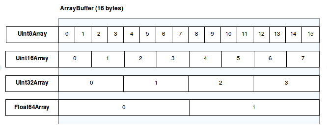

# 一.JavaScript介绍

JavaScript 是一种多范式的动态语言，它包含类型、运算符、标准内置（built-in）对象和方法。它的语法来源于 Java 和 C，所以这两种语言的许多语法特性同样适用于 JavaScript。JavaScript 通过原型链而不是类来支持**面向对象编程**。JavaScript 同样支持函数式编程——因为它们也是对象，函数也可以被保存在变量中，并且像其他对象一样被传递。

# 二.注释

```js
/*
多行
注释
*/

// 单行注释
```

# 三.JavaScript数据类型

## 1.动态和弱类型

JavaScript 是一种有着**动态类型**的动态语言。

JavaScript 中的变量与任何特定值类型没有任何关联，并且任何变量都可以分配（重新分配）所有类型的值。

```js
let foo = 42; // foo 现在是一个数值
foo = "bar"; // foo 现在是一个字符串
foo = true; // foo 现在是一个布尔值
```

JavaScript 也是一个**弱类型语言**，这意味着当操作涉及不匹配的类型是否，它将允许隐式类型转换，而不是抛出一个错误。

```js
const foo = 42; // foo is a number
const result = foo + "1"; // JavaScript coerces foo to a string, so it can be concatenated with the other operand
console.log(result); // 421
```

强制隐式转换是非常方便的，但是如果开发者不打算转换，或者打算向另一个方向转换（例如，字符串转数值而不是数值到字符串），则会存在潜在的隐患。对于 symbol 和 BigInt，JavaScript 总是不允许某些隐式类型转换。

## 2.原始值

除了 Object 以外，所有类型都定义了表示在语言最低层面的**不可变值**。我们将这些值称为**原始值**。

除了null，所有原始类型都可以使用 typeof 运算符测试。typeof null 返回 "object"，因此必须使用 === null 来测试 null。

除了 null 和 undefined，所有原始类型都有它们相应的对象包装类型，这为处理原始值提供可用的方法。例如，Number 对象提供向 toExponential() 这样的方法。当在原始值上访问属性时，JavaScript 会自动将值包装到相应的包装对象中，并访问对象上的属性。然而，在 null 或 undefined 上访问属性时，会抛出 TypeError 异常，这需要采用可选链运算符。

| 类型      | `typeof` 返回值 | 对象包装器 |
| :-------- | :-------------- | :--------- |
| Null      | `"object"`      | N/A        |
| Undefined | `"undefined"`   | N/A        |
| Boolean   | `"boolean"`     | Boolean    |
| Number    | `"number"`      | Number     |
| BigInt    | `"bigint"`      | BigInt     |
| String    | `"string"`      | String     |
| Symbol    | `"symbol"`      | Symbol     |

## 3.数据类型

## 1.String

字符串（一串文本）：字符串的值必须用引号（单双均可，必须成对）括起来。避免引号的问题，可以使用转义字符`\`。

ES6新增模板字符串：

```js
let name = '张三'; 
let sayHello = `hello,my name is ${name}`; // hello, my name is zhangsan
```

```js
 let result = { 
     name: 'zhangsan', 
     age: 20,
     sex: '男' 
 } 
 let html = ` <div>
     <span>${result.name}</span>
     <span>${result.age}</span>
     <span>${result.sex}</span>
 </div> `;
```

```js
const sayHello = function () { 
    return '哈哈哈哈 追不到我吧 我就是这么强大';
 }; 
 let greet = `${sayHello()} 哈哈哈哈`;
 console.log(greet); // 哈哈哈哈 追不到我吧 我就是这么强大 哈哈哈哈
```

## 2.Number

整数或者是小数，或者是科学计数(e)。

## 3.Boolean

布尔值，true/false

## 4.Array

数组，用于在单一引用中存储多个值的结构。

ES6扩展运算符：可以将数组或者对象转为用逗号分隔的参数序列

```js
let ary = [1, 2, 3];
...ary  // 1, 2, 3
```

## 5.Object

对象，JavaScript 里一切皆对象，一切皆可储存在变量里。

## 6.Set

ES6 提供了新的数据结构  Set。它类似于数组，但是成员的值都是唯一的，没有重复的值。

```js
const s = new Set();
const set = new Set([1, 2, 3, 4, 4]);//{1, 2, 3, 4}
```

# 四.运算符

## 1.算术运算符

加（+）：将两个数字相加，或拼接两个字符串。

减（-）、乘（*）、除（/）：与基础算术一致。

幂（**）：返回第一个操作数取第二个操作数的幂的结果。

取模（%）：返回左侧操作数除以右侧操作数的余数。它总是与被除数的符号保持一致。

## 2.关系运算符

`in`：判断指定的属性是否在指定的对象或其原型链中。

```js
const car = { make: 'Honda', model: 'Accord', year: 1998 };

console.log('make' in car);
// Expected output: true
```

`instanceof`： 运算符判断一个对象是否是另一个对象的实例。

```js
function Car(make, model, year) {
  this.make = make;
  this.model = model;
  this.year = year;
}
const auto = new Car('Honda', 'Accord', 1998);

console.log(auto instanceof Car);
// Expected output: true

console.log(auto instanceof Object);
// Expected output: true
```

`<`（小于）：小于运。

`>`（大于）：大于。

`<=`：小于等于。

`>=`：大于等于。

## 3.相等运算符

`==`：相等运算符。检查其两个操作数是否相等，返回一个布尔值结果。它会比较不同类型的操作数，并尝试强制类型转换。

```js
console.log(1 == 1);
// Expected output: true

console.log('hello' == 'hello');
// Expected output: true

console.log('1' ==  1);
// Expected output: true

console.log(0 == false);
// Expected output: true
```

`!=`：不等运算符。检查其两个操作数是否不相等，并返回布尔结果。它会转换并比较不同类型的操作数。

```js
console.log(1 != 1);
// Expected output: false

console.log('hello' != 'hello');
// Expected output: false

console.log('1' !=  1);
// Expected output: false

console.log(0 != false);
// Expected output: false
```

`===`：全等运算符。检查它的两个操作数是否相等，并且返回一个布尔值结果。严格相等运算符总是认为不同类型的操作数是不同的。

```js
console.log(1 === 1);
// Expected output: true

console.log('hello' === 'hello');
// Expected output: true

console.log('1' ===  1);
// Expected output: false

console.log(0 === false);
// Expected output: false
```

`!==`：非全等运算符。检查它的两个对象是否不相等，返回一个布尔结果。严格不相等运算符总是认为不同类型的对象是不同的。

```js
console.log(1 !== 1);
// Expected output: false

console.log('hello' !== 'hello');
// Expected output: false

console.log('1' !==  1);
// Expected output: true

console.log(0 !== false);
// Expected output: true
```

## 4.位移运算符

`<<`：按位左移运算符。

`>>`：按位右移运算符。

`>>>`：按位无符号右移运算符。

## 5.二进制位运算符

二进制运算符将它们的操作数作为 32 个二进制位（0 或 1）的集合。

**按位与**（**`&`**）：运算符在两个操作数对应的二进位都为 `1` 时，该位的结果值才为 `1`。

**按位或**（**`|`**）：运算符在其中一个或两个操作数对应的二进制位为 `1` 时，该位的结果值为 `1`。

**按位异或**（**`^`**）：运算符在两个操作数有且仅有一个对应的二进制位为 `1` 时，该位的结果值为 `1`。

## 6.逻辑运算符

逻辑运算符典型的用法是用于布尔（逻辑）值运算，它们返回布尔值。

**取非（!）**：返回逻辑相反的值。

**逻辑与**（**`&&`**，逻辑连接）：全部操作数为真时才返回真。当从左到右求值时，该操作符返回第一个**假值**操作数的值；如果它们都是**真值**，则返回最后一个操作数的值。

```js
const a = 3;
const b = -2;

console.log(a > 0 && b > 0);
// Expected output: false
```

**逻辑或**（`||`，逻辑析取）:当且仅当其一个或多个操作数为真，其运算结果为真。当从左到右求值时，该操作符返回第一个**真值**操作数的值；如果它们都是**假值**，则返回最后一个操作数的值。

```js
const a = 3;
const b = -2;

console.log(a > 0 || b > 0);
// Expected output: true
```

**空值合并运算符（??）**：当左侧的操作数为 null 或者 undefined 时，返回其右侧操作数，否则返回左侧操作数。

```js
const foo = null ?? 'default string';
console.log(foo);
// Expected output: "default string"

const baz = 0 ?? 42;
console.log(baz);
// Expected output: 0
```

**可选链运算符**（**`?.`**）：允许读取位于连接对象链深处的属性的值，而不必明确验证链中的每个引用是否有效。?. 运算符的功能类似于 . 链式运算符，不同之处在于，在引用为空 (nullish ) (null 或者 undefined) 的情况下不会引起错误，该表达式短路返回值是 undefined。与函数调用一起使用时，如果给定的函数不存在，则返回 undefined。

```js
const adventurer = {
  name: 'Alice',
  cat: {
    name: 'Dinah'
  }
};

const dogName = adventurer.dog?.name;
console.log(dogName);
// Expected output: undefined

console.log(adventurer.someNonExistentMethod?.());
// Expected output: undefined
```

## 7.条件（三元）运算符

**条件（三元）运算符**：是 JavaScript 唯一使用三个操作数的运算符。一个条件后跟一个问号（?），如果条件为真值，则执行冒号（:）前的表达式；若条件为假值，则执行最后的表达式。

```js
console.log(true ? '$2.00' : '$10.00');
// Expected output: "$2.00"

console.log(false ? '$2.00' : '$10.00');
// Expected output: "$10.00"

console.log(null ? '$2.00' : '$10.00');
// Expected output: "$10.00"
```

## 8.赋值运算符

简单赋值运算符（=）：给变量赋值。

**乘法赋值**（**`\*=`**）：运算符将变量乘以右操作数的值，并将结果赋值给该变量。

```js
let a = 2;

console.log(a *= 3);
// Expected output: 6

console.log(a *= 'hello');
// Expected output: NaN
```

**幂赋值**（**`\**=`**）：运算符将左侧变量的值设置为右操作数的幂次方。

```js
let a = 3;

console.log(a **= 2);
// Expected output: 9

console.log(a **= 0);
// Expected output: 1

console.log(a **= 'hello');
// Expected output: NaN
```

**除法赋值**（**`/=`**）：运算符将变量除以右操作数的值，并将结果赋值给该变量。

```js
let a = 3;

a /= 2;
console.log(a);
// Expected output: 1.5

a /= 0;
console.log(a);
// Expected output: Infinity

a /= 'hello';
console.log(a);
// Expected output: NaN
```

**取余赋值**（**`%=`**）：运算符将变量除以右操作数的值，并将余数赋值给该变量。

```js
let a = 3;

console.log(a %= 2);
// Expected output: 1

console.log(a %= 0);
// Expected output: NaN

console.log(a %= 'hello');
// Expected output: NaN
```

加法赋值运算符（`+=`）：将右操作数的值添加到变量，并将结果分配给该变量。两个操作数的类型决定了加法赋值运算符的行为，可能为加法或拼接。

```js
let a = 2;
let b = 'hello';

console.log(a += 3); // Addition
// Expected output: 5

console.log(b += ' world'); // Concatenation
// Expected output: "hello world"
```

**减法赋值**（**`-=`**）：运算符从变量中减去右操作数的值，并将结果赋值给该变量。

```js
let a = 2;

console.log(a -= 3);
// Expected output: -1

console.log(a -= 'Hello');
// Expected output: NaN
```

左移赋值运算符（`<<=`）将变量向左移动指定的位数，并将结果赋值给变量。

```js
let a = 5; // 00000000000000000000000000000101

a <<= 2;   // 00000000000000000000000000010100

console.log(a);
// Expected output: 20
```

右移赋值运算符（`>>=`）将变量向右移动指定的位数，并将结果赋值给变量。

```js
let a = 5;      //  00000000000000000000000000000101

a >>= 2;        //  00000000000000000000000000000001
console.log(a);
// Expected output: 1

let b = -5;     //  11111111111111111111111111111011

b >>= 2;        //  11111111111111111111111111111110
console.log(b);
// Expected output: -2
```

按位与赋值运算符（`&=`）使用两个操作数的二进制表示，对它们进行按位与运算并将结果赋值给变量。

```js
let a = 5;      // 00000000000000000000000000000101
a &= 3;         // 00000000000000000000000000000011

console.log(a); // 00000000000000000000000000000001
// Expected output: 1
```

**按位或赋值**（**`|=`**) 运算符使用两个操作数的二进制表示，对它们执行按位或运算并将结果分配给变量。

```js
let a = 5;      // 00000000000000000000000000000101
a |= 3;         // 00000000000000000000000000000011

console.log(a); // 00000000000000000000000000000111
// Expected output: 7
```

逻辑与赋值（&&=）运算仅在 x 为真值时为其赋值。

```js
let a = 1;
let b = 0;

a &&= 2;
console.log(a);
// Expected output: 2

b &&= 2;
console.log(b);
// Expected output: 0
```

逻辑或赋值（||=）仅在 x 为假值时为其赋值。

```js
const a = { duration: 50, title: '' };

a.duration ||= 10;
console.log(a.duration);
// Expected output: 50

a.title ||= 'title is empty.';
console.log(a.title);
// Expected output: "title is empty"
```

逻辑空赋值运算符（??=）仅在 x 是空值（null 或 undefined）时对其赋值。

```js
const a = { duration: 50 };

a.duration ??= 10;
console.log(a.duration);
// Expected output: 50

a.speed ??= 25;
console.log(a.speed);
// Expected output: 25
```

`解构`赋值：是一种 Javascript 表达式。可以将数组中的值或对象的属性取出，赋值给其他变量。

```js
let a, b, rest;
[a, b] = [10, 20];

console.log(a);
// Expected output: 10

console.log(b);
// Expected output: 20

[a, b, ...rest] = [10, 20, 30, 40, 50];

console.log(rest);
// Expected output: Array [30, 40, 50]
```

```js
 let person = { name: 'zhangsan', age: 20 }; 
 let { name, age } = person;
 console.log(name); // 'zhangsan' 
 console.log(age); // 20

 let {name: myName, age: myAge} = person; // myName myAge 属于别名
 console.log(myName); // 'zhangsan' 
 console.log(myAge); // 20
```

# 五.变量

变量可以使用var、let、const声明

```js
let myName;
let myAge;
const PI = 3.14;
```

**`var` 语句** 用于声明一个函数范围或全局范围的变量，并可将其初始化为一个值（可选）。

```js
var x = 1;

if (x === 1) {
  var x = 2;

  console.log(x);
  // Expected output: 2
}

console.log(x);
// Expected output: 2
```

**`let`** 语句声明一个块级作用域的局部变量，并可以初始化为一个值（可选）。

```js
let x = 1;

if (x === 1) {
  let x = 2;

  console.log(x);
  // Expected output: 2
}

console.log(x);
// Expected output: 1
```

`const`声明常量，常量就是值（内存地址）不能变化的量。如果是基本数据类型，不能更改值，如果是复杂数据类型，不能更改地址值

```js
const PI = 3.14;
```

注意：

- 变量名大小写敏感——因此`myage`与`myAge`是 2 个不同的变量。
- 变量名不要以数字开头。
- 变量名不要以下划线开头—— 以下划线开头的被某些 JavaScript 设计为特殊的含义，因此可能让人迷惑。
- 避免使用 JavaScript 的保留字给变量命名。

# 六.条件语句

```js
if (condition) {
  /* 条件为真时运行的代码 */
}
```

```js
if (condition) {
  /* 条件为真时运行的代码 */
} else {
  /* 否则，运行其他的代码 */
}
```

# 七.循环

## 1.for循环

```js
for (initializer; exit-condition; final-expression) {
  // code to run
}
```

- **初始化器**：这通常是一个设置为一个数字的变量，它被递增来计算循环运行的次数。它也有时被称为**计数变量**。
- **退出条件**：如前面提到的，这个定义循环何时停止循环。这通常是一个表现为比较运算符的表达式，用于查看退出条件是否已满足的测试。
- **最终条件**：这总是被判断（或运行），每个循环已经通过一个完整的迭代消失时间。它通常用于增加（或在某些情况下递减）计数器变量，使其更接近退出条件值。

```js
for (var i = 0; i < 100; i++) {
  /*运行的代码*/
}
```

## 2.while循环

```js
while (exit-condition) {
  // code to run
}
```

## 3.do...while循环

```js
do {
  // code to run
} while (exit-condition)
```

## 5.退出循环break

如果要在所有迭代完成之前退出循环，可以使用 break 语句。

```js
for (var i = 0; i < 100; i++) {
  /*运行的代码*/
  if (i==50) break;
}
```

## 6.continue 跳过迭代

不是完全跳出循环，而是跳过当前循环而执行下一个循环。

```js
for (var i = 0; i < 100; i++) {
  if (i==50) continue;
  console.log(i);
}
```

# 八.函数与方法

函数称为对象**方法**（method）的一部分。

## 1.自定义函数

```js
//创建函数，参数可以有0个或多个，返回值可选。
function myfunc(var1,var2) {
  
  return "返回值";
}

//调用函数
myfunc(10,20)
```

参数可以是：对象，字面量，函数。

返回值可以是：对象，字面量，函数。

## 2.匿名函数

```js
function() {
  alert('hello');
}
```

匿名函数没有函数名，它也不会自己做任何事情。你通常将匿名函数与事件处理程序一起使用。

```js
var myButton = document.querySelector('button');

myButton.onclick = function() {
  alert('hello');
}
```

```js
//可以将匿名函数分配为变量的值
var myGreeting = function() {
  alert('hello');
}

//调用
myGreeting();
```

## 3.作用域

函数内部块是局部作用域，函数内定义的变量和其他东西都在它们自己的单独的范围内，意味着它们被锁在自己独立的隔间中，不能被函数外的代码访问。

函数的最外层被称为全局作用域。在全局作用域内定义的值可以在任意地方访问。

## 4.闭包

**闭包**（closure）是一个函数以及其捆绑的周边环境状态（**lexical environment**，**词法环境**）的引用的组合。换而言之，闭包让开发者可以从内部函数访问外部函数的作用域。

```js
function init() {
  var name = "Mozilla"; // name 是一个被 init 创建的局部变量
  function displayName() { // displayName() 是内部函数，一个闭包
      alert(name); // 使用了父函数中声明的变量
  }
  displayName();
}
init();
```

```js
function makeAdder(x) {
  return function(y) {
    return x + y;
  };
}

var add5 = makeAdder(5);
var add10 = makeAdder(10);

console.log(add5(2));  // 7
console.log(add10(2)); // 12
```

## 5.箭头函数

ES6中新增的定义函数的方式。

```js
() => {} //()：代表是函数； =>：必须要的符号，指向哪一个代码块；{}：函数体
const fn = () => {}//代表把一个函数赋值给fn
```

```js
//普通函数 
function sum(num1, num2) { 
     return num1 + num2; 
 }
 //es6写法
 const sum = (num1, num2) => num1 + num2; 
```

如果形参只有一个，可以省略小括号

```js
const fn = v => v;
```

箭头函数不绑定this关键字，箭头函数中的this，指向的是函数定义位置的上下文this

```js
const obj = { name: '张三'} 
 function fn () { 
     console.log(this);//this 指向 是obj对象
     return () => { 
         console.log(this);//this 指向 的是箭头函数定义的位置，那么这个箭头函数定义在fn里面，而这个fn指向是的obj对象，所以这个this也指向是obj对象
     } 
 } 
 const resFn = fn.call(obj); 
 resFn();
```

## 6.剩余参数

剩余参数语法允许我们将一个不定数量的参数表示为一个数组，不定参数定义方式，这种方式很方便的去声明不知道参数情况下的一个函数

```js
function sum (first, ...args) {
     console.log(first); // 10
     console.log(args); // [20, 30] 
 }
 sum(10, 20, 30)
```

```js
let students = ['wangwu', 'zhangsan', 'lisi'];
let [s1, ...s2] = students; 
console.log(s1);  // 'wangwu' 
console.log(s2);  // ['zhangsan', 'lisi']
```

# 九.网页事件

## 1.介绍

在 Web 中，事件在浏览器窗口中被触发并且通常被绑定到窗口内部的特定部分 — 可能是一个元素、一系列元素、被加载到这个窗口的 HTML 代码或者是整个浏览器窗口。如:

- 用户在某个元素上点击鼠标或悬停光标。
- 用户在键盘中按下某个按键。

每个可用的事件都会有一个**事件处理器**，也就是事件触发时会运行的代码块。

当我们定义了一个用来回应事件被激发的代码块的时候，我们说我们**注册了一个事件处理器**。

注意：事件处理器有时候被叫做**事件监听器**。从我们的用意来看这两个名字是相同的，尽管严格地来说这块代码既监听也处理事件。监听器留意事件是否发生，然后处理器就是对事件发生做出的回应。

## 2.使用方式

### 2.1事件处理器属性

存在于事件处理程序过程的属性中。

```js
const btn = document.querySelector('button');

btn.onclick = function() {
  alert('clicked');
}
```

### 2.2内联事件处理器（不推荐使用）

在 Web 上注册事件处理程序的最早方法是类似于下面所示的**事件处理程序 HTML 属性**(也称为内联事件处理程序)—属性值实际上是当事件发生时要运行的 JavaScript 代码。

```js
<button onclick="bgChange()">Press me</button>

function bgChange() {
  alert('clicked');
}
```

### 2.3 addEventListener() 和 removeEventListener()

```js
//注册事件监听器
const btn = document.querySelector('button');

function bgChange() {
  alert('clicked');
}

btn.addEventListener('click', bgChange);
```

```js
//事件监听器使用匿名函数
btn.addEventListener('click', function() {
  alert('clicked');
});
```

```js
//移除事件监听器
btn.removeEventListener('click', bgChange);
```

```js
//也可以给同一个监听器注册多个处理器，当元素被点击时两个函数都会工作
btn.addEventListener('click', functionA);
btn.addEventListener('click', functionB);
```

### 2.4 事件对象

有时候在事件处理函数内部，您可能会看到一个固定指定名称的参数，例如`event`，`evt`或简单的`e`。这被称为**事件对象**，它被自动传递给事件处理函数，以提供额外的功能和信息。

```js
function bgChange(e) {
  const rndCol = 'rgb(' + random(255) + ',' + random(255) + ',' + random(255) + ')';
  e.target.style.backgroundColor = rndCol;
  console.log(e);
}

btn.addEventListener('click', bgChange);
```

在函数中包括一个事件对象`e`，并在函数中设置背景颜色样式在 `e.target` 上——它指的是按钮本身。事件对象 `e` 的 `target` 属性始终是事件刚刚发生的元素的引用。

当您要在多个元素上设置相同的事件处理程序时，`e.target`非常有用，并且在发生事件时对所有元素执行某些操作。

例如，你可能有一组 16 块方格，当它们被点击时就会消失。用 e.target 总是能准确选择当前操作的方格并执行操作让它消失，而不是必须以更困难的方式选择它。

```js
const divs = document.querySelectorAll('div');

for (let i = 0; i < divs.length; i++) {
  divs[i].onclick = function(e) {
    e.target.style.backgroundColor = bgChange();
  }
}
```

### 2.5阻止默认行为

有时，你会遇到一些情况，你希望事件不执行它的默认行为。最常见的例子是 Web 表单，例如自定义注册表单。当你填写详细信息并按提交按钮时，自然行为是将数据提交到服务器上的指定页面进行处理，并将浏览器重定向到某种“成功消息”页面（或 相同的页面，如果另一个没有指定。）

当用户没有正确提交数据时，麻烦就来了 - 作为开发人员，你希望停止提交信息给服务器，并给他们一个错误提示，告诉他们什么做错了，以及需要做些什么来修正错误。一些浏览器支持自动的表单数据验证功能，但由于许多浏览器不支持，因此建议你不要依赖这些功能，并实现自己的验证检查。

```html
<form>
  <div>
    <label for="fname">First name: </label>
    <input id="fname" type="text">
  </div>
  <div>
    <label for="lname">Last name: </label>
    <input id="lname" type="text">
  </div>
  <div>
     <input id="submit" type="submit">
  </div>
</form>
<p></p>
```

```js
const form = document.querySelector('form');
const fname = document.getElementById('fname');
const lname = document.getElementById('lname');
const submit = document.getElementById('submit');
const para = document.querySelector('p');

form.onsubmit = function(e) {
  if (fname.value === '' || lname.value === '') {
    e.preventDefault(); //停止表单提交
    para.textContent = 'You need to fill in both names!';
  }
}
```

### 2.6事件冒泡及捕获

事件冒泡和捕捉是两种机制，主要描述当在一个元素上有两个相同类型的事件处理器被激活会发生什么。

当一个事件发生在具有**父元素**的元素上时，浏览器运行两个不同的阶段：

- 捕获阶段：浏览器检查元素的最外层祖先`<html>`，是否在捕获阶段中注册了一个`onclick`事件处理程序，如果是，则运行它。

  然后，它移动到`<html>`中单击元素的下一个祖先元素，并执行相同的操作，然后是单击元素再下一个祖先元素，依此类推，直到到达实际点击的元素。

- 冒泡阶段：浏览器检查实际点击的元素是否在冒泡阶段中注册了一个`onclick`事件处理程序，如果是，则运行它。

  然后它移动到下一个**直接的祖先元素**，并做同样的事情，然后是下一个，等等，直到它到达`<html>`元素。

标准事件对象具有可用的名为`stopPropagation()`的函数，当在事件对象上调用该函数时，它只会让当前事件处理程序运行，但事件不会在冒泡链上进一步扩大，因此将不会有更多事件处理器被运行 (不会向上冒泡)。

默认情况下，所有事件处理程序都是在冒泡阶段注册的，这在大多数情况下更有意义。如果您真的想在**捕获阶段注册一个事件**，那么您可以通过使用addEventListener()注册您的处理程序，并将可选的第三个属性设置为 true。

### 2.7事件委托

冒泡还允许我们利用事件委托——这个概念依赖于这样一个事实，如果你想要在大量子元素中单击任何一个都可以运行一段代码，您可以将事件监听器设置在其父节点上，并让子节点上发生的事件冒泡到父节点上，而不是每个子节点单独设置事件监听器。

# 十.JavaScript 对象

## 1.对象基础

创建对象的方式：

1. Object()方法来创建

   ```js
   var Dog = new Object();
   Dog.name = "旺财";
   ```

2. 字面量法创建对象

   ```js
   var Dog = {
     name = "大黄",
   }
   ```

3. 自定义函数创建对象

   ```js
   function Dog(name){
     this.name = name;
   }
   var dog = new Dog("旺财");
   ```

4. `class`关键字创建的对象

   ```js
   class Polygon {
     constructor(height, width) {
       this.height = height;
       this.width = width;
     }
   }
   ```

5. 工厂模式创建对象

   ```js
   function createDog(name){
     var obj = new Object();
     obj.name = name;
     return obj;
   }
   
   var d1 = createDog("旺财");
   ```

基础使用：

```js
//创建复杂对象
var person = {
  //成员属性
  name : {
    first : 'Bob',
    last : 'Smith'
	},
  age : 32,
  gender : 'male',
  interests : ['music', 'skiing'],
  //成员方法
  bio : function() {
    alert(this.name[0] + ' ' + this.name[1] + ' is ' + this.age + ' years old. He likes ' + this.interests[0] + ' and ' + this.interests[1] + '.');
  },
  greeting: function() {
    alert('Hi! I\'m ' + this.name[0] + '.');
  }
};

//使用点表示法访问对象成员属性、方法
person.name.first
person.age
person.interests[1]
person.bio()
person.greeting()

//使用括号表示法访问对象成员属性、方法
//使用了关联了值的名字，而不是索引去选择元素。
person['name']['first']
person['age']

//设置对象成员，可以更新原有的成员值，也可以设置新的成员
person.age = 45
person['name']['last'] = 'Cratchit'
person['eyes'] = 'hazel'
person.farewell = function() { alert("Bye everybody!") }
```

## 2.this关键字

关键字this指向了当前代码运行时的对象 （the current object the code is being written inside）。this关键字保证了当代码的上下文 (context) 改变时变量的值的正确性。

```js
var person1 = {
  name : 'Chris',
  greeting: function() {
    alert('Hi! I\'m ' + this.name + '.');
  }
}

var person2 = {
  name : 'Brian',
  greeting: function() {
    alert('Hi! I\'m ' + this.name + '.');
  }
}
```

**改变函数内部 this 指向**：

- call()方法

  ```js
  var o = {
  	name: 'andy'
  }
   function fn(a, b) {
        console.log(this);
        console.log(a+b)
  };
  fn(1,2)// 此时的this指向的是window 运行结果为3
  fn.call(o,1,2)//此时的this指向的是对象o,参数使用逗号隔开,运行结果为3
  ```

- apply方法

  ```js
  var o = {
  	name: 'andy'
  }
   function fn(a, b) {
        console.log(this);
        console.log(a+b)
  };
  fn()// 此时的this指向的是window 运行结果为3
  fn.apply(o,[1,2])//此时的this指向的是对象o,参数使用数组传递 运行结果为3
  ```

- bind方法：bind() 方法不会调用函数,但是能改变函数内部this 指向，返回的是原函数改变this之后产生的新函数

  ```js
   var o = {
   name: 'andy'
   };
  
  function fn(a, b) {
  	console.log(this);
  	console.log(a + b);
  };
  var f = fn.bind(o, 1, 2); //此处的f是bind返回的新函数
  f();//调用新函数  this指向的是对象o 参数使用逗号隔开
  ```

## 3.static关键字

```js
class ClassWithStaticMethod {
  static staticProperty = 'someValue';
  static staticMethod() {
    return 'static method has been called.';
  }
  static {
    console.log('Class static initialization block called');
  }
}

console.log(ClassWithStaticMethod.staticProperty);
```

# 十一.对象原型

原型是 JavaScript 对象相互继承特性的机制。

## 1.原型链

```js
//试着创建一个对象字面量
const myObject = {
  city: "Madrid",
  greet() {
    console.log(`来自 ${this.city} 的问候`);
  },
};
myObject.greet(); // 来自 Madrid 的问候
```

在控制台打印该对象myObject，控制台会列出该对象可用的一系列属性。你会看到，除了 `city` 和 `greet` 外，还有很多其他属性。

```js
Prototype：
  __defineGetter__
  __defineSetter__
  __lookupGetter__
  __lookupSetter__
  __proto__
  constructor
  hasOwnProperty
  isPrototypeOf
  propertyIsEnumerable
  toLocaleString
  toString
  valueOf
```

JavaScript 中所有的对象都有一个内置属性，称为它的 **prototype**（原型）。

它本身是一个对象，故原型对象也会有它自己的原型，逐渐构成了**原型链**。原型链终止于拥有 `null` 作为其原型的对象上。

注意：指向对象原型的属性并不是 prototype。它的名字不是标准的，但实际上所有浏览器都使用 __proto__。访问对象原型的标准方法是 Object.getPrototypeOf()。

当你试图访问一个对象的属性时：如果在对象本身中找不到该属性，就会在原型中搜索该属性。如果仍然找不到该属性，那么就搜索**原型的原型**，以此类推，直到找到该属性，或者到达链的末端，在这种情况下，返回 `undefined`。

有个对象叫 `Object.prototype`，它是最基础的原型，所有对象默认都拥有它。`Object.prototype` 的原型是 `null`，所以它位于原型链的终点。


## 2.属性遮蔽

当在一个对象`myObject`中定义了一个属性`func1()`，而在该对象的原型中定义了一个同名的属性`func1()`。浏览器首先在对象`myObject`中寻找具有该名称的属性，如果 `myObject` 没有定义该属性，才检查原型。这叫做属性的`遮蔽`。

## 3.设置原型

### 3.1 Object.create()

`Object.create()`方法创建一个新的对象，并允许你指定一个将被用作新对象原型的对象。

```js
const personPrototype = {
  greet() {
    console.log("hello!");
  },
};

const carl = Object.create(personPrototype);
carl.greet(); // hello!
```

### 3.2 使用构造函数

在 JavaScript 中，所有的函数都有一个名为 `prototype` 的属性。当你调用一个函数作为构造函数时，这个属性被设置为新构造对象的原型（按照惯例，在名为 `__proto__` 的属性中）。

因此，如果我们设置一个构造函数的 `prototype`，我们可以确保所有用该构造函数创建的对象都被赋予该原型：

```js
const personPrototype = {
  greet() {
    console.log(`你好，我的名字是 ${this.name}！`);
  },
};

function Person(name) {
  this.name = name;
}

Object.assign(Person.prototype, personPrototype);
// 或 Person.prototype.greet = personPrototype.greet;
```

```js
const reuben = new Person("Reuben");
reuben.greet(); // 你好，我的名字是 Reuben！
```

### 3.3 自有属性

上面的 `Person` 构造函数创建的对象有两个属性：

- `name` 属性，在构造函数中设置，在 `Person` 对象中可以直接看到
- `greet()` 方法，在原型中设置

这里的`name`，被称为自有属性，你可以使用静态方法`Object.hasOwn()`检查一个属性是否是自有属性

```js
const irma = new Person("Irma");

console.log(Object.hasOwn(irma, "name")); // true
console.log(Object.hasOwn(irma, "greet")); // false
```

# 十二.面向对象编程

## 1.类和构造函数

```js
class Person {

  name;
	
  //构造函数
  constructor(name) {
    this.name = name;
  }

  introduceSelf() {
    console.log(`Hi! I'm ${this.name}`);
  }

}
```

```js
const giles = new Person('Giles');

giles.introduceSelf(); // Hi! I'm Giles
```

如果你不需要任何特殊的初始化内容，你可以省略构造函数，默认的构造函数会被自动生成。

```js
class Animal {

  sleep() {
    console.log('zzzzzzz');
  }

}

const spot = new Animal();

spot.sleep(); // 'zzzzzzz'
```

## 2.继承

```js
class Professor extends Person {

  teaches;

  constructor(name, teaches) {
    super(name); //调用父类的构造函数
    this.teaches = teaches;
  }

  introduceSelf() {
    console.log(`My name is ${this.name}, and I will be your ${this.teaches} professor.`);
  }

  grade(paper) {
    const grade = Math.floor(Math.random() * (5 - 1) + 1);
    console.log(grade);
  }

}
```

```js
const walsh = new Professor('Walsh', 'Psychology');
walsh.introduceSelf();  // 'My name is Walsh, and I will be your Psychology professor'

walsh.grade('my paper'); // some random grade
```

## 3.封装

```js
class Student extends Person {
	
  //私有属性
  #year;

  constructor(name, year) {
    super(name);
    this.#year = year;
  }


  introduceSelf() {
    console.log(`Hi! I'm ${this.name}, and I'm in year ${this.#year}.`);
  }

  canStudyArchery() {
    return this.#year > 1;
  }
	
  //私有方法
  #somePrivateMethod() {
    console.log('You called me?');
  }
}
```

# 十三.异常

**抛出异常**

```js
function openFile(fileName) {
  if (!exists(fileName)) {
    throw new Error('找不到文件 ' + fileName)
  }
  // ...
}
```

**捕获异常**

```js
try {
  openFile('../test.js')
} catch(e) {
  // 优雅地处理抛出的期望
}
//可选
finally {
    // 无论发生异常都始终执行的代码
}
```

**Error**

`Error` 类型用于表示一般异常。这种类型的异常最常用于实现用户定义的异常。

```js
const myError = new Error('Error!!!')

console.log(myError.message) // Error!!!
```

注意：

```js
if (somethingBadHappened) {
  //错误用法，会抛异常ReferenceError: specs is not defined
  throw 'Something bad happened'
}
```

# 十四.异步JavaScript

## 1.同步

```js
const name = 'Miriam';
const greeting = `Hello, my name is ${name}!`;
console.log(greeting);
// "Hello, my name is Miriam!"
```

实际上浏览器是按照我们书写代码的顺序一行一行地执行程序的。浏览器会等待代码的解析和工作，在上一行完成后才会执行下一行。这也使得它成为一个**同步程序**。

## 2.异步

异步函数为我们提供：

- 通过调用一个函数来启动一个长期运行的操作
- 让函数开始操作并立即返回，这样我们的程序就可以保持对其他事件做出反应的能力
- 当操作最终完成时，通知我们操作的结果。

## 3.事件处理程序

事件处理程序实际上就是异步编程的一种形式：你提供的函数（事件处理程序）将在事件发生时被调用（而不是立即被调用）。如果“事件”是“异步操作已经完成”，那么你就可以看到事件如何被用来通知调用者异步函数调用的结果的。

## 4.回调

事件处理程序是一种特殊类型的回调函数。而回调函数则是一个被传递到另一个函数中的会在适当的时候被调用的函数。

```js
function doStep1(init) {
  return init + 1;
}
function doStep2(init) {
  return init + 2;
}
function doStep3(init) {
  return init + 3;
}

//同步函数
function doOperation() {
  let result = 0;
  result = doStep1(result);
  result = doStep2(result);
  result = doStep3(result);
  console.log(`结果：${result}`);
}
doOperation();
```

```js
function doStep1(init, callback) {
  const result = init + 1;
  callback(result);
}
function doStep2(init, callback) {
  const result = init + 2;
  callback(result);
}
function doStep3(init, callback) {
  const result = init + 3;
  callback(result);
}

//回调函数实现异步
function doOperation() {
  doStep1(0, result1 => {
    doStep2(result1, result2 => {
      doStep3(result2, result3 => {
        console.log(`结果：${result3}`);
      });
    });
  });
}
doOperation();
```

因为必须在回调函数中调用回调函数，我们就得到了这个深度嵌套的 `doOperation()` 函数，这就更难阅读和调试了。在一些地方这被称为“回调地狱”或“厄运金字塔”

面对这样的嵌套回调，处理错误也会变得非常困难：你必须在“金字塔”的每一级处理错误，而不是在最高一级一次完成错误处理。

由于以上这些原因，大多数现代异步 API 都不使用回调。事实上，JavaScript 中异步编程的基础是`Promise`。

## 5.Promise

**Promise** 是现代 JavaScript 中异步编程的基础，是一个由异步函数返回的可以向我们指示当前操作所处的状态的对象。在 Promise 返回给调用者的时候，操作往往还没有完成，但 Promise 对象可以让我们操作最终完成时对其进行处理（无论成功还是失败）。

Promise 有三种状态：

- **待定（pending）**：初始状态，既没有被兑现，也没有被拒绝。这是调用 `fetch()` 返回 Promise 时的状态，此时请求还在进行中。
- **已兑现（fulfilled）**：意味着操作成功完成。当 Promise 完成时，它的 `then()` 处理函数被调用。
- **已拒绝（rejected）**：意味着操作失败。当一个 Promise 失败时，它的 `catch()` 处理函数被调用。

### 5.1 fetch()

```js
const fetchPromise = fetch('https://mdn.github.io/learning-area/javascript/apis/fetching-data/can-store/products.json');

console.log(fetchPromise);

fetchPromise.then( response => {
  console.log(`已收到响应：${response.status}`);
});

console.log("已发送请求……");
```

1. 调用 `fetch()` API，并将返回值赋给 `fetchPromise` 变量。
2. 紧接着，输出 `fetchPromise` 变量，输出结果应该像这样：`Promise { <state>: "pending" }`。这告诉我们有一个 `Promise` 对象，它有一个 `state`属性，值是 `"pending"`。`"pending"` 状态意味着操作仍在进行中。
3. 将一个处理函数传递给 Promise 的 **`then()`** 方法。当（如果）获取操作成功时，Promise 将调用我们的处理函数，传入一个包含服务器的响应的 `Response`对象。
4. 输出一条信息，说明我们已经发送了这个请求。

完整的输出结果应该是这样的：

```js
Promise { <state>: "pending" }
已发送请求……
已收到响应：200
```

### 5.2 链式使用 Promise

```js
const fetchPromise = fetch('https://mdn.github.io/learning-area/javascript/apis/fetching-data/can-store/products.json');

fetchPromise.then( response => {
  //json()也是一个异步方法
  const jsonPromise = response.json();
  jsonPromise.then( json => {
    console.log(json[0].name);
  });
});
```

但是这样就会像`回调地狱`，但 Promise 的优雅之处在于 `then()` 本身也会返回一个 Promise，这个 Promise 将指示 `then()` 中调用的异步函数的完成状态。所以就可以改成这样：

```js
const fetchPromise = fetch('https://mdn.github.io/learning-area/javascript/apis/fetching-data/can-store/products.json');

fetchPromise
  .then( response => {
    return response.json();
  })
  .then( json => {
    console.log(json[0].name);
  });
```

这被称为 **Promise 链**，意味着当我们需要连续进行异步函数调用时，我们就可以避免不断嵌套带来的缩进增加。

### 5.3错误捕获

`Promise` 对象提供了一个 `catch()`方法来支持错误处理。这很像 `then()`：你调用它并传入一个处理函数。然后，当异步操作*成功*时，传递给 `then()` 的处理函数被调用，而当异步操作*失败*时，传递给 `catch()` 的处理函数被调用。

如果将 `catch()` 添加到 Promise 链的末尾，它就可以在任何异步函数失败时被调用。于是，我们就可以将一个操作实现为几个连续的异步函数调用，并在一个地方处理所有错误。

```js
const fetchPromise = fetch('bad-scheme://mdn.github.io/learning-area/javascript/apis/fetching-data/can-store/products.json');

fetchPromise
  .then( response => {
    if (!response.ok) {
      throw new Error(`HTTP 请求错误：${response.status}`);
    }
    return response.json();
  })
  .then( json => {
    console.log(json[0].name);
  })
  .catch( error => {
    console.error(`无法获取产品列表：${error}`);
  });
```

### 5.4 合并使用多个 Promise

当你的操作由几个异步函数组成，而且你需要在开始下一个函数之前完成之前每一个函数时，你需要的就是 Promise 链。但是在其他的一些情况下，你可能需要合并多个异步函数的调用。

- #### Promise.all()

有时你需要所有的 Promise 都得到实现，但它们并不相互依赖。在这种情况下，将它们一起启动然后在它们全部被兑现后得到通知会更有效率。这里需要 `Promise.all()`方法。它接收一个 Promise 数组，并返回一个单一的 Promise。

由`Promise.all()`返回的 Promise：

- 当且仅当数组中*所有*的 Promise 都被兑现时，才会通知 `then()` 处理函数并提供一个包含所有响应的数组，数组中响应的顺序与被传入 `all()` 的 Promise 的顺序相同。
- 会被拒绝——如果数组中有*任何一个* Promise 被拒绝。此时，`catch()` 处理函数被调用，并提供被拒绝的 Promise 所抛出的错误。

```js
const fetchPromise1 = fetch('https://mdn.github.io/learning-area/javascript/apis/fetching-data/can-store/products.json');
const fetchPromise2 = fetch('https://mdn.github.io/learning-area/javascript/apis/fetching-data/can-store/not-found');
const fetchPromise3 = fetch('https://mdn.github.io/learning-area/javascript/oojs/json/superheroes.json');

Promise.all([fetchPromise1, fetchPromise2, fetchPromise3])
  .then( responses => {
    for (const response of responses) {
      console.log(`${response.url}：${response.status}`);
    }
  })
  .catch( error => {
    console.error(`获取失败：${error}`)
  });
```

向三个不同的 URL 发出三个 `fetch()` 请求。如果它们都被兑现了，我们将输出每个请求的响应状态。如果其中任何一个被拒绝了，我们将输出失败的情况。

- #### Promise.any()

有时，你可能需要等待一组 Promise 中的某一个 Promise 的执行，而不关心是哪一个。在这种情况下，你需要 `Promise.any()`。这就像 `Promise.all()`，不过在 Promise 数组中的任何一个被兑现时它就会被兑现，如果所有的 Promise 都被拒绝，它也会被拒绝。

```js
const fetchPromise1 = fetch('https://mdn.github.io/learning-area/javascript/apis/fetching-data/can-store/products.json');
const fetchPromise2 = fetch('https://mdn.github.io/learning-area/javascript/apis/fetching-data/can-store/not-found');
const fetchPromise3 = fetch('https://mdn.github.io/learning-area/javascript/oojs/json/superheroes.json');

Promise.any([fetchPromise1, fetchPromise2, fetchPromise3])
  .then( response => {
    console.log(`${response.url}：${response.status}`);
  })
  .catch( error => {
    console.error(`获取失败：${error}`)
  });
```

## 6.async 和 await

`async` 关键字为你提供了一种更简单的方法来处理基于异步 Promise 的代码。在一个函数的开头添加 async，就可以使其成为一个异步函数。

```js
async function myFunction() {
  // 这是一个异步函数
}
```

在异步函数中，你可以在调用一个返回 Promise 的函数之前使用 `await` 关键字。这使得代码在该点上等待，直到 Promise 被完成，这时 Promise 的响应被当作返回值，或者被拒绝的响应被作为错误抛出。

这使你能够编写像同步代码一样的异步函数。

```js
async function fetchProducts() {
  try {
    // 在这一行之后，我们的函数将等待 `fetch()` 调用完成
    // 调用 `fetch()` 将返回一个“响应”或抛出一个错误
    const response = await fetch('https://mdn.github.io/learning-area/javascript/apis/fetching-data/can-store/products.json');
    if (!response.ok) {
      throw new Error(`HTTP 请求错误：${response.status}`);
    }
    // 在这一行之后，我们的函数将等待 `response.json()` 的调用完成
    // `response.json()` 调用将返回 JSON 对象或抛出一个错误
    const json = await response.json();
    console.log(json[0].name);
  }
  catch(error) {
    console.error(`无法获取产品列表：${error}`);
  }
}

fetchProducts();
```

这里我们调用 `await fetch()`，我们的调用者得到的并不是 `Promise`，而是一个完整的 `Response` 对象。

我们甚至可以使用 `try...catch` 块来处理错误，就像我们在写同步代码时一样。

但请注意，这个写法只在异步函数中起作用。异步函数总是返回一个 Pomise，所以你不能做这样的事情：

```js
async function fetchProducts() {
  try {
    const response = await fetch('https://mdn.github.io/learning-area/javascript/apis/fetching-data/can-store/products.json');
    if (!response.ok) {
      throw new Error(`HTTP 请求错误：${response.status}`);
    }
    const json = await response.json();
    return json;
  }
  catch(error) {
    console.error(`无法获取产品列表：${error}`);
  }
}

const json = fetchProducts();
console.log(json[0].name);   // json 是一个 Promise 对象，因此这句代码无法正常工作
```

你需要做一些事情，比如：

```js
async function fetchProducts() {
  try {
    const response = await fetch('https://mdn.github.io/learning-area/javascript/apis/fetching-data/can-store/products.json');
    if (!response.ok) {
      throw new Error(`HTTP 请求错误：${response.status}`);
    }
    const json = await response.json();
    return json;
  }
  catch(error) {
    console.error(`无法获取产品列表：${error}`);
  }
}

const jsonPromise = fetchProducts();
jsonPromise.then((json) => console.log(json[0].name));
```

你可能会在需要使用 Promise 链地方使用 `async` 函数，这也使得 Promise 的工作更加直观。

就像一个 Promise 链一样，`await` 强制异步操作以串联的方式完成。如果下一个操作的结果取决于上一个操作的结果，这是必要的，但如果不是这样，像 `Promise.all()` 这样的操作会有更好的性能。

## 7.实现基于 Promise 的 API

通常情况下，当你实现一个基于 promise 的 API 时，你会使用事件、普通回调，或者消息传递模型来包裹一个异步操作。你将会使用一个 `Promise` 对象来合理的处理操作的成功或者失败。

### 7.1实现 alarm() API

在这个示例中我们将会实现一个基于 promise 的 alarm API，叫做 `alarm()` 。它将以被唤醒人的名字和一个在人被唤醒前以毫秒为单位的延迟作为参数。在延迟之后，本函数将会发送一个包含需要被唤醒人名字的 "Wake up!" 消息。

我们将会使用 `setTimeout()`来实现 `alarm()` 函数。`setTimeout()` 以一个回调函数和一个以毫秒为单位的延迟作为参数。当调用 `setTimeout()` 时，它将启动一个设置为给定延迟的计时器，当时间过期时，它就会调用给定的回调函数。

```html
<button id="set-alarm">Set alarm</button>
<div id="output"></div>
```

```js
const output = document.querySelector('#output');
const button = document.querySelector('#set-alarm');

function setAlarm() {
  window.setTimeout(() => {
    output.textContent = 'Wake up!';
  }, 1000);
}

button.addEventListener('click', setAlarm);
```

### 7.2 Promise() 构造器

我们的 `alarm()` 函数返回一个在定时器过期时才会被兑现的 `Promise`。它将会传递一个 "Wake up!" 消息到 `then()` 处理器中，也会在当调用者提供一个负延迟值时拒绝这个 promise。

`Promise()` 构造器使用单个函数作为参数。我们把这个函数称作`执行器`（executor）。当你创建一个新的 promise 的时候你需要实现这个执行器。

这个执行器本身采用两个参数，这两个参数都是函数，通常被称作 `resolve` 和 `reject`。在你的执行器实现里，你调用原始的异步函数。如果异步函数成功了，就调用 `resolve`，如果失败了，就调用 `reject`。如果执行器函数抛出了一个错误，`reject` 会被自动调用。你可以将任何类型的单个参数传递到 `resolve` 和 `reject` 中。

所以我们可以像下面这样实现 `alarm()`：

```js
const name = document.querySelector('#name');
const delay = document.querySelector('#delay');
const button = document.querySelector('#set-alarm');
const output = document.querySelector('#output');

function alarm(person, delay) {
  return new Promise((resolve, reject) => {
    if (delay < 0) {
      throw new Error('Alarm delay must not be negative');
    }
    window.setTimeout(() => {
      resolve(`Wake up, ${person}!`);
    }, delay);
  });
}

button.addEventListener('click', () => {
  alarm(name.value, delay.value)
    .then(message => output.textContent = message)
    .catch(error => output.textContent = `Couldn't set alarm: ${error}`);
});
```

### 7.3 在 alarm() API 上使用 async 和 await

自从 `alarm()` 返回了一个 `Promise`，我们可以对它做任何我们可以对其他任何 promise 做的事情：`Promise.all()`，和 `async` / `await`：

```js
const name = document.querySelector('#name');
const delay = document.querySelector('#delay');
const button = document.querySelector('#set-alarm');
const output = document.querySelector('#output');

function alarm(person, delay) {
  return new Promise((resolve, reject) => {
    if (delay < 0) {
      throw new Error('Alarm delay must not be negative');
    }
    window.setTimeout(() => {
      resolve(`Wake up, ${person}!`);
    }, delay);
  });
}

button.addEventListener('click', async () => {
  try {
    const message = await alarm(name.value, delay.value);
    output.textContent = message;
  }
  catch (error) {
    output.textContent = `Couldn't set alarm: ${error}`;
  }
});
```

# 十五.元素操作

## 1.DOM操作

```html
<!DOCTYPE html>
<html lang="en-US">
  <head>
    <meta charset="utf-8" />
    <title>Simple DOM example</title>
  </head>
  <body>
    <section>
      
      <p>Here we will add a link to the
        <a href="https://www.mozilla.org/">Mozilla homepage</a>
      </p>
    </section>
  </body>
</html>
```

`querySelector()` 调用将匹配文档中出现的第一个 `a`元素。

```js
const link = document.querySelector('a');
```

`Document.querySelectorAll()`，它可以匹配文档中与选择器相匹配的每个元素，并将它们的引用存储在一个叫做 `NodeList` 的`数组`对象中。

`Document.getElementById()`，选择一个 `id` 属性值已知的元素。

`Document.getElementsByTagName()`，返回页面中包含的所有已知类型元素的数组。

`Document.createElement()`创建一个新的元素。

```js
//选择一个元素
const sect = document.querySelector('section');

//创建一个新的元素
const para = document.createElement('p');
para.textContent = 'We hope you enjoyed the ride.';

//给一个DOM添加子元素
sect.appendChild(para);
```

`Node.cloneNode()`复制并添加元素。

`Node.removeChild()`删除节点

## 2.CSS操作

`Document.stylesheets`获得一个附加在文档上的所有样式表的列表，它返回一个包含`CSSStyleSheet`对象的类数组。

`HTMLElement.style`包含了文档中每个元素的内联样式信息。你可以设置这个对象的属性来直接更新元素样式。直接将内联样式添加到你想动态样式的元素上。

```js
para.style.color = 'white';
```

`Element.setAttribute()`它接受两个参数：想在元素上设置的属性、要为它设置的值。

```js
<style>
  .highlight {
    color: white;
    background-color: black;
    padding: 10px;
    width: 250px;
    text-align: center;
  }
</style>

//给元素class属性添加highlight值
para.setAttribute('class', 'highlight');
```

# 十六.JS发送Http请求

```js
// 调用 `fetch()`，传入 URL。
fetch(url)
  // fetch() 返回一个 promise。当我们从服务器收到响应时，
  // 会使用该响应调用 promise 的 `then()` 处理器。
  .then((response) => {
    // 如果请求没有成功，我们的处理器会抛出错误。
    if (!response.ok) {
      throw new Error(`HTTP 错误：${response.status}`);
    }
    // 否则（如果请求成功），我们的处理器通过调用
    // response.text() 以获取文本形式的响应，
    // 并立即返回 `response.text()` 返回的 promise。
    return response.text();
  })
  // 若成功调用 response.text()，会使用返回的文本来调用 `then()` 处理器，
  // 然后我们将其拷贝到 `poemDisplay` 框中。
  .then((text) => poemDisplay.textContent = text)
  // 捕获可能出现的任何错误，
  // 并在 `poemDisplay` 框中显示一条消息。
  .catch((error) => poemDisplay.textContent = `获取诗歌失败：${error}`);
```

```js
//比较旧的一个api
const request = new XMLHttpRequest();

try {
  request.open('GET', url);

  request.responseType = 'json';

  request.addEventListener('load', () => initialize(request.response));
  request.addEventListener('error', () => console.error('XHR error'));

  request.send();

} catch (error) {
  console.error(`XHR error ${request.status}`);
}
```

# 十七.客户端存储

## 1.cookies

从早期的网络时代开始，网站就使用 cookies 来存储信息，以在网站上提供个性化的用户体验。它们是网络上最早最常用的客户端存储形式。 因为在那个年代，有许多问题——无论是从技术上的还是用户体验的角度——都是困扰着 cookies 的问题。这些问题非常重要，以至于当第一次访问一个网站时，欧洲居民会收到消息，告诉他们是否会使用 cookies 来存储关于他们的数据，而这是由一项被称为`欧盟 Cookie条例`的欧盟法律导致的。

## 2.Web Storage

**Web Storage API**提供了一种非常简单的语法，用于存储和检索较小的、由名称和相应值组成的数据项。当您只需要存储一些简单的数据时，比如用户的名字，用户是否登录，屏幕背景使用了什么颜色等等，这是非常有用的。

web storage 数据都包含在浏览器内两个类似于对象的结构中：

- sessionStorage：只要浏览器开着，数据就会一直保存 (关闭浏览器时数据会丢失)

  ```js
  // 保存数据到 sessionStorage
  sessionStorage.setItem('key', 'value');
  
  // 从 sessionStorage 获取数据
  let data = sessionStorage.getItem('key');
  
  // 从 sessionStorage 删除保存的数据
  sessionStorage.removeItem('key');
  
  // 从 sessionStorage 删除所有保存的数据
  sessionStorage.clear();
  ```

- localStorage：一直保存数据，甚至到浏览器关闭又开启后也是这样。

  ```js
  //存
  localStorage.setItem('name','Chris');
  
  //取
  var myName = localStorage.getItem('name');
  
  //删除
  localStorage.removeItem('name');
  ```

## 3.IndexedDB

IndexedDB API为浏览器提供了一个完整的数据库系统来存储复杂的数据。这可以用于存储从完整的用户记录到甚至是复杂的数据类型，如音频或视频文件。

# 十八.类型化数组

**JavaScript 类型化数组**（typed array）是一种类似数组的对象，并提供了一种用于在内存缓冲区中访问原始二进制数据的机制。

`Array`存储的对象能动态增多和减少，并且可以存储任何 JavaScript 值。JavaScript 引擎会做一些内部优化，以便对数组的操作可以很快。然而，随着 Web 应用程序变得越来越强大，尤其一些新增加的功能例如：音频视频编辑、访问 WebSockets 的原始数据等，很明显有些时候如果使用 JavaScript 代码可以快速方便地通过类型化数组来操作原始的二进制数据将会非常有帮助。JavaScript 类型化数组中的每一个元素都是原始二进制值，而二进制值采用多种支持的格式之一（从 8 位整数到 64 位浮点数）。

## 1.类型数组架构

为了达到最大的灵活性和效率，JavaScript 类型化数组将实现拆分为**缓冲**和**视图**两部分。

- 缓冲（由`ArrayBuffer`对象实现）描述的是一个数据分块。缓冲没有格式可言，并且不提供访问其内容的机制。
- 为了访问在缓冲对象中包含的内存，你需要使用视图。视图提供了上下文——即数据类型、起始偏移量和元素数——将数据转换为实际有类型的数组。



`ArrayBuffer`是一种数据类型，用来表示一个通用的、固定长度的二进制数据缓冲区。你不能直接操作 ArrayBuffer 中的内容；你需要创建一个类型化数组的视图或一个描述缓冲数据格式的`DataView`，使用它们来读写缓冲区中的内容。

`类型化数组视图`具有自描述性的名字和所有常用的数值类型像 `Int8`、`Uint32`、`Float64` 等等。有一种特殊类型的数组 `Uint8ClampedArray`。它仅操作 0 到 255 之间的数值。

# 十九.并发模型与事件循环

JavaScript 有一个基于**事件循环**的并发模型，事件循环负责执行代码、收集和处理事件以及执行队列中的子任务。


## 1.栈

函数调用形成了一个由若干帧组成的栈。

## 2.堆

对象被分配在堆中，堆是一个用来表示一大块（通常是非结构化的）内存区域的计算机术语。

## 3.队列

一个 JavaScript 运行时包含了一个待处理消息的消息队列。每一个消息都关联着一个用以处理这个消息的回调函数。

在`事件循环`期间的某个时刻，运行时会从最先进入队列的消息开始处理队列中的消息。被处理的消息会被移出队列，并作为输入参数来调用与之关联的函数。正如前面所提到的，调用一个函数总是会为其创造一个新的栈帧。

函数的处理会一直进行到执行栈再次为空为止；然后事件循环将会处理队列中的下一个消息（如果还有的话）。

## 4.事件循环

之所以称之为 **事件循环**，是因为它经常按照类似如下的方式来被实现：

```js
while (queue.waitForMessage()) {
  queue.processNextMessage();
}
```

`queue.waitForMessage()` 会同步地等待消息到达 (如果当前没有任何消息等待被处理)。

- **执行至完成**：每一个消息完整地执行后，其他消息才会被执行。

- **添加消息**：在浏览器里，每当一个事件发生并且有一个事件监听器绑定在该事件上时，一个消息就会被添加进消息队列。如果没有事件监听器，这个事件将会丢失。所以当一个带有点击事件处理器的元素被点击时，就会像其他事件一样产生一个类似的消息。

  函数`setTimeout`接受两个参数：待加入队列的消息和一个时间值（可选，默认为 0）。这个时间值代表了消息被实际加入到队列的最小延迟时间。如果队列中没有其他消息并且栈为空，在这段延迟时间过去之后，消息会被马上处理。但是，如果有其他消息，`setTimeout` 消息必须等待其他消息处理完。因此第二个参数仅仅表示最少延迟时间，而非确切的等待时间。

- **零延迟**：零延迟并不意味着回调会立即执行。以 0 为第二参数调用 `setTimeout` 并不表示在 0 毫秒后就立即调用回调函数。其等待的时间取决于队列里待处理的消息数量。

- **多个运行时互相通信**：一个 web worker 或者一个跨域的 `iframe` 都有自己的栈、堆和消息队列。两个不同的运行时只能通过`postMessage`方法进行通信。如果另一个运行时侦听 `message` 事件，则此方法会向该运行时添加消息。

## 5.永不阻塞

JavaScript 的事件循环模型与许多其他语言不同的一个非常有趣的特性是，它永不阻塞。处理 I/O 通常通过事件和回调来执行，所以当一个应用正等待一个 IndexedDB查询返回或者一个`XHR`请求返回时，它仍然可以处理其他事情，比如用户输入。


